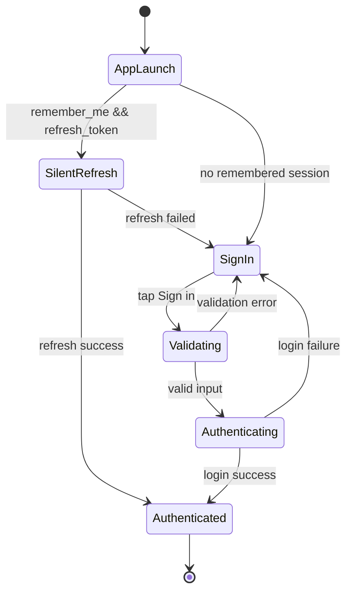

# Login Page UX Design — EarthRanger Mobile

**Date:** 2026-03-24  
**Scope:** Mobile sign-in entry for `leader` and `ranger` users  
**Goal:** Require username/password on app launch, with optional **Remember me** to keep users signed in across app restarts.

## 1) Experience Goals

1. Fast and clear sign-in for field users.
2. Never expose app content before authentication.
3. Minimize repeated credential entry with secure remembered sessions.
4. Keep behavior consistent with existing backend endpoints:
   - `POST /api/mobile/auth/login`
   - `POST /api/mobile/auth/refresh`
   - `POST /api/mobile/auth/logout`
   - `GET /api/mobile/me`

## 2) Navigation and Entry Rules

### App Launch Guard

- On app open, route first to an auth gate.
- If no valid session: show **Sign In Page**.
- If `remember_me = true` and refresh token exists:
  - Attempt silent refresh.
  - On success → enter app.
  - On failure → clear stored tokens and return to sign-in.

### Post-login Routing

- `leader` → leader-capable app routes.
- `ranger` → ranger-scoped app routes.

## 3) Screen Layout (Mobile)

### Top Area
- EarthRanger logo
- Title: **Sign in**
- Subtitle: “Use your EarthRanger account to continue”

### Form Card
1. **Username** text field
2. **Password** text field
   - Eye icon to show/hide password
3. Row:
   - Left: **Remember me** checkbox
   - Right: optional “Forgot password?” link (hide if not supported)
4. Primary CTA: **Sign in** button
5. Secondary hint text for errors/status

### Footer
- App version
- Optional security hint: “Never share your password.”

## 4) Interaction Behavior

### Validation

- Username required.
- Password required.
- Show inline validation on submit.

### Submit

- Disable button while request is in progress.
- Show loading state in button.
- On success:
  - Save session in `AuthProvider`.
  - If remember checked: persist refresh token + role + username + remember flag.
  - If not checked: keep session in memory only (or clear persisted tokens on next close).

### Error States

- Invalid credentials: “Username or password is incorrect.”
- Network error: “Cannot connect. Please try again.”
- Expired remembered session after refresh failure:
  - “Session expired. Please sign in again.”
  - Prefill username if available.

## 5) Remember Me Rules

- `Remember me = ON`
  - Persist minimal auth data needed for silent re-login.
  - On next launch, attempt `refresh` before showing login.
- `Remember me = OFF`
  - Do not persist long-lived session credentials.
  - User re-enters credentials next app launch.

**Security note:**
- Never store raw password after login.
- Persist tokens only via secure storage strategy approved for project runtime.
- Keep server as source of truth for role authorization.

## 6) Suggested Visual Style

- Reuse current app visual language:
  - rounded card container
  - soft white/gradient background
  - green primary action (`accentGreen`)
- Keep spacing generous for gloved/thumb use in field conditions.
- Minimum 44px touch targets.

## 7) Accessibility & Usability

- High contrast labels and error text.
- Keyboard “Next/Done” flow: username → password → submit.
- Screen-reader labels:
  - Username input
  - Password input
  - Remember me checkbox
  - Sign in button
- Password visibility toggle has accessible label (“Show password” / “Hide password”).

## 8) State Model

## 9) Copy Keys to Add (Localization)

- `sign_in_title`
- `sign_in_subtitle`
- `remember_me`
- `session_expired_relogin`
- `network_error_try_again`
- `invalid_credentials`
- `show_password`
- `hide_password`

## 10) Implementation Handoff Notes

- Replace current dialog-style admin login with a dedicated full-screen sign-in page.
- Add auth gate before landing/home routes.
- Keep existing role/session fields in `AuthProvider` and extend for remember-me persistence.
- Keep backend role claims (`leader`/`ranger`) authoritative.
